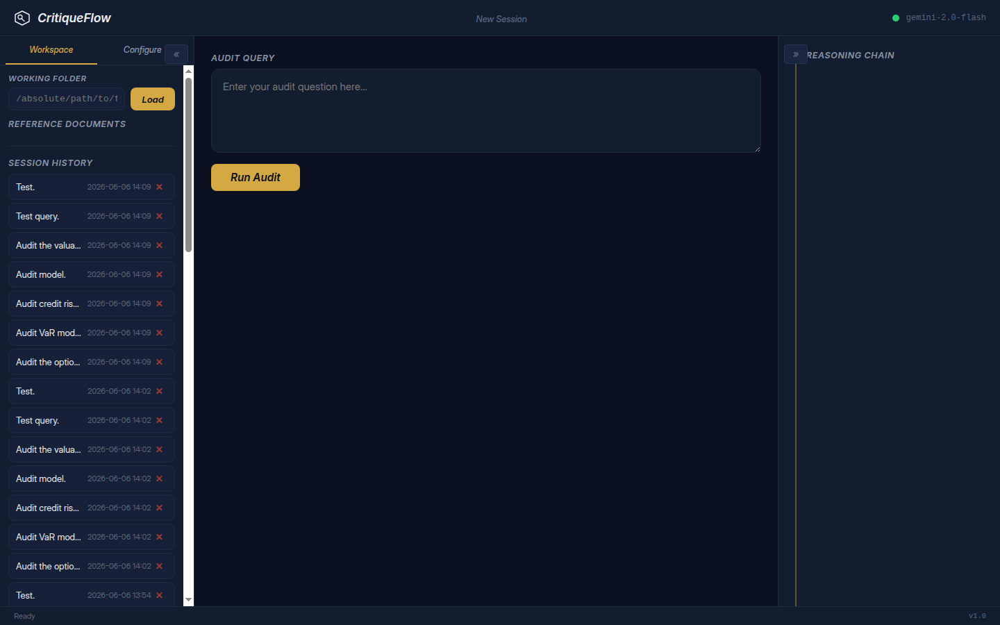
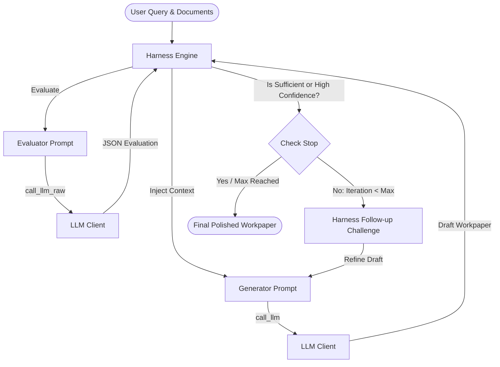

<div align="center">
  <h1 align="center">CritiqueFlow</h1>
  <p align="center">
    <strong>Automated AI Audit & Review Harness</strong>
    <br />
    <em>Enforcing the Maker-Checker standard for Internal Audit, Compliance, and SOX</em>
  </p>

  <p align="center">
    <a href="https://www.python.org/"></a>
    <a href="#-testing"></a>
    <a href="LICENSE"></a>
  </p>
</div>

---



## 🏦 Executive Summary

For Audit Directors and Internal Audit teams, **CritiqueFlow** is a powerful harness designed to automate the drafting, evaluation, and refinement of audit workpapers, control testings, and compliance reports.

When using Large Language Models (LLMs) to assess complex environments—such as IT security controls, financial reporting, or operational risk—standard AI chat interfaces suffer from **self-validation bias**. A single LLM session that drafts a document will routinely fail to recognize its own omissions or logical leaps.

CritiqueFlow solves this through a rigorous, automated **generator-evaluator loop** that mimics the "maker-checker" (or four-eyes) dynamic required by standard audit practices and regulatory frameworks.

---

## 🎯 Why CritiqueFlow? The "Maker-Checker" Advantage

CritiqueFlow eliminates role contamination by explicitly separating the drafting phase from the critical review phase. 

1. **The Generator (Maker):** Drafts the initial audit workpaper or findings report based on your query and uploaded evidence (PDF, Docx, Markdown, Excel, TXT).
2. **The Evaluator (Checker):** Independently critiques the draft against your organization's specific audit guidelines and test scripts. It identifies gaps, insufficient evidence, and issues a follow-up challenge.
3. **Iterative Harness:** Feeds the critique back to the generator to refine the draft. This adversarial loop runs until the evaluator's confidence and sufficiency scores meet your strict thresholds.

---

## 🔪 The Adversarial Auditor Stance

CritiqueFlow operates on a strict, pre-configured philosophy designed for independent assurance:
> **"Controls do not function inherently; they simply haven't failed yet. If you cannot find a gap, you are not looking hard enough."**

By defaulting to professional skepticism, the Evaluator agents ensure that every drafted finding requires concrete evidence and quantitative thresholds rather than qualitative hand-waving.

---

## 📊 Out-of-the-Box Support: Model Risk Management (MRM)

While CritiqueFlow is highly adaptable for any audit function (IT, SOX, Compliance), it comes **pre-configured out-of-the-box for Model Risk Auditors**. 

The system includes pre-loaded system prompts built by ex-quant auditors, specifically tuned for deep-dive validations across:
- **Market Risk Models:** VaR, FRTB Capital Models, Econometric Capital Models, SIMM.
- **Credit Risk Models:** Exposure profiles (EE, EPE, EEPE, PFE) feeding into CVA, DVA, FVA calculations.
- **Valuation Models:** Across Equities, Fixed Income, Commodities, and Credit.

For MRM teams, the harness explicitly enforces guidelines from frameworks like *SR 11-7* and *OCC 2011-12* from day one.

---

## 🏛️ Architecture Overview



---

## 🚀 Quick Start Guide

Experience the power of automated, self-correcting audits in minutes.

### 1. Prerequisites
- Python 3.10, 3.11, or 3.12
- `uv` package manager (recommended for speed) or standard `pip`

### 2. Installation
```bash
git clone https://github.com/your-repo/CritiqueFlow.git
cd CritiqueFlow/audit-harness

# Using uv (Recommended)
uv venv
source .venv/bin/activate  # On Windows: .venv\Scripts\activate
uv pip install -r requirements.txt
```

### 3. Configuration
CritiqueFlow requires a simple `.env` file to connect to your preferred LLM endpoints.

```bash
cp .env.example .env
```
*Edit `.env` to include your `LLM_ENDPOINT` and `LLM_API_KEY`.*

### 4. Launch the Harness
**Linux / macOS:**
```bash
chmod +x critiqueflow.sh
./critiqueflow.sh
```

**Cross-Platform Manual Startup:**
```bash
python run.py
```
*The UI will automatically open at `http://127.0.0.1:5000`.*

---

## 🖥️ Using the Dashboard

1. **Load Workspace**: Point the harness to your local directory of evidence and documentation.
2. **Select Context Documents**: Seamlessly select PDFs, Word docs, and Excel sheets to inject into the audit context.
3. **Execute Audit**: Enter your audit prompt (e.g., *"Assess the access control evidence in the attached SOX testing documentation"*).
4. **Inspect the Reasoning Chain**: Watch in real-time as the Generator drafts the workpaper, and the Evaluator ruthlessly critiques it for missing testing requirements.
5. **Export Findings**: Once the Evaluator is satisfied, export the final, high-quality Markdown workpaper straight to your local drive.

---

## 🧪 Testing & Reliability

CritiqueFlow is built with a test-first methodology, ensuring it stands up to the scrutiny of any internal technology audit. 

To run the complete suite of **138 unit tests**:
```bash
pytest tests/ -v
```

---

## 📄 License & Compliance

CritiqueFlow is open-source software licensed under the [MIT License](LICENSE).
